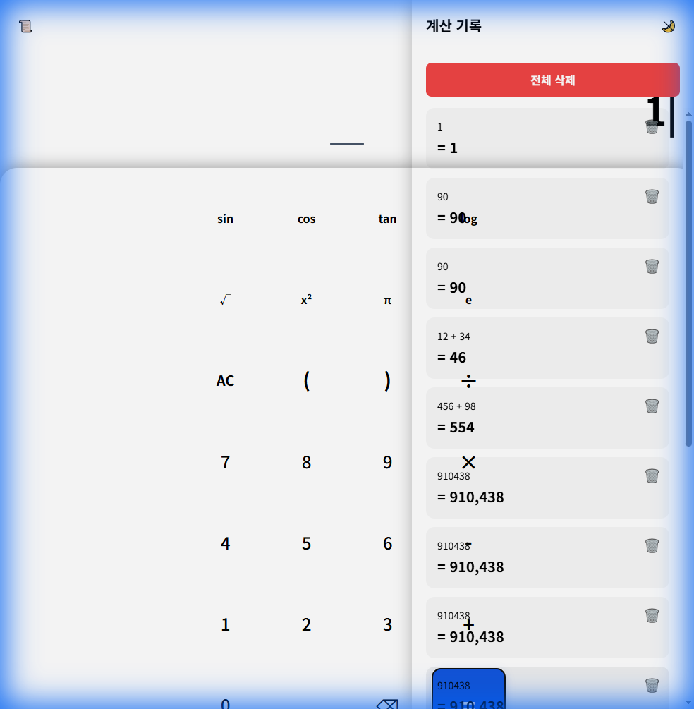
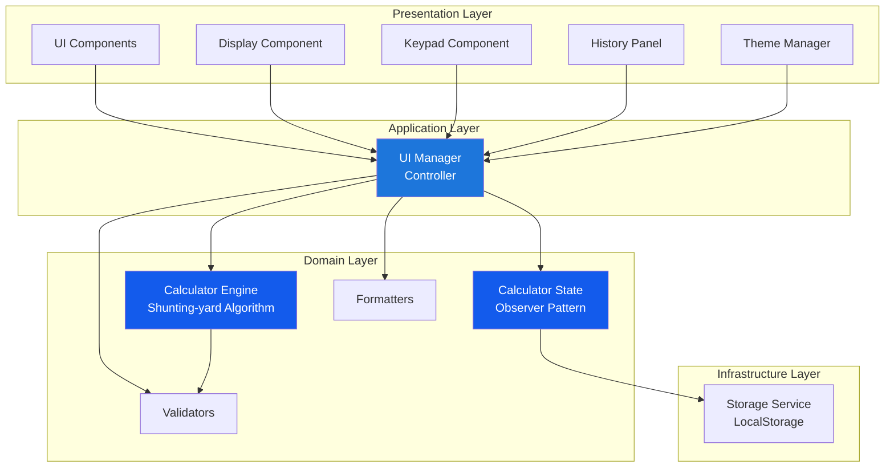
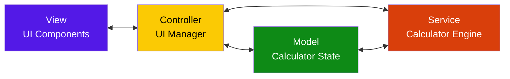
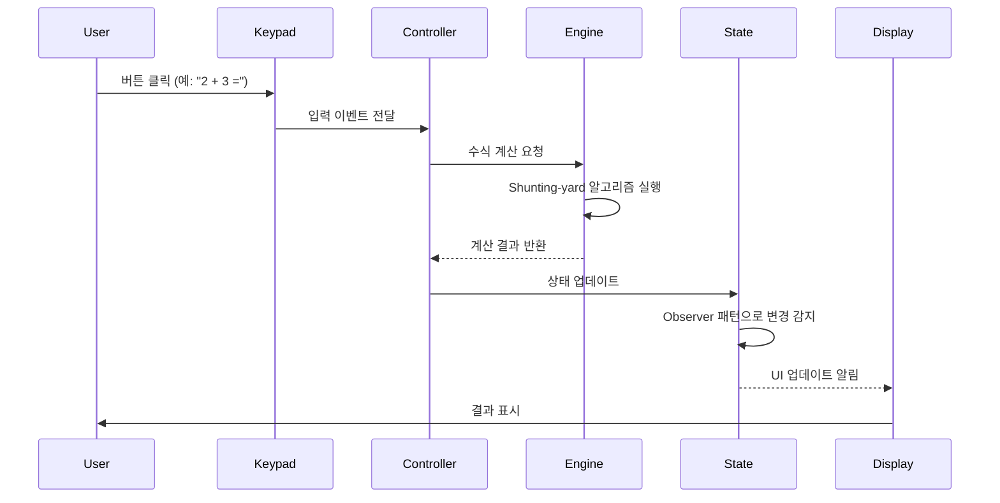

# 공학용 계산기 (Engineering Calculator)

[](https://www.typescriptlang.org/)
[](https://vitejs.dev/)
[](https://tailwindcss.com/)
[](LICENSE)

> 현대적인 웹 기술 스택과 소프트웨어 공학 원칙을 적용한 공학용 계산기 웹 애플리케이션

**🔗 Live Demo**: [https://yonghwan-ko02.github.io/calculator-demo/](https://yonghwan-ko02.github.io/calculator-demo/)



---

## 📋 목차

- [프로젝트 소개](#-프로젝트-소개)
- [핵심 기술 및 특징](#-핵심-기술-및-특징)
- [아키텍처](#-아키텍처)
- [기술 스택](#-기술-스택)
- [개발 원칙](#-개발-원칙)
- [주요 기능](#-주요-기능)
- [설치 및 실행](#-설치-및-실행)
- [프로젝트 구조](#-프로젝트-구조)
- [개발 프로세스](#-개발-프로세스)
- [성과 및 성능](#-성과-및-성능)

---

## 🎯 프로젝트 소개

이 프로젝트는 **현대적인 웹 개발 기술**과 **소프트웨어 공학 원칙**을 적용하여 개발한 공학용 계산기 웹 애플리케이션입니다. 단순한 계산기 구현을 넘어, **확장 가능한 아키텍처**, **테스트 주도 개발(TDD)**, **SOLID 원칙** 준수를 통해 실무 수준의 코드 품질을 달성했습니다.

### 🎓 학습 목표 및 성과

- ✅ **TypeScript**를 활용한 타입 안전성 확보
- ✅ **TDD(Test-Driven Development)** 방법론 적용
- ✅ **SOLID 원칙**을 준수한 객체지향 설계
- ✅ **MVCS 패턴**을 통한 관심사 분리
- ✅ **CI/CD 파이프라인** 구축 (GitHub Actions)
- ✅ **반응형 디자인** 및 접근성(Accessibility) 고려

---

## 💡 핵심 기술 및 특징

### 1. **테스트 주도 개발 (TDD)**
- 코어 로직(계산 엔진, 상태 관리, 유틸리티)에 대해 **테스트 우선 작성**
- **80% 이상의 코드 커버리지** 달성 (코어 로직 기준)
- Vitest를 활용한 단위 테스트 자동화

### 2. **SOLID 원칙 준수**
- **단일 책임 원칙(SRP)**: 각 클래스가 하나의 책임만 수행
- **개방-폐쇄 원칙(OCP)**: 확장에는 열려있고 수정에는 닫힌 구조
- **의존성 역전 원칙(DIP)**: 추상화에 의존하는 설계

### 3. **확장 가능한 아키텍처**
- **Shunting-yard 알고리즘**을 활용한 수식 파싱
- **Observer 패턴**을 통한 상태 관리
- 모듈화된 컴포넌트 구조로 유지보수성 향상

### 4. **현대적인 개발 환경**
- **Vite** 기반 빠른 개발 서버 및 빌드
- **ESLint + Prettier**를 통한 코드 품질 관리
- **GitHub Actions**를 통한 자동 배포

---

## 🏗️ 아키텍처

### 전체 시스템 아키텍처



### MVCS 패턴 적용



### 데이터 흐름



### 계산 엔진 알고리즘

```mermaid
flowchart TD
    Start([수식 입력]) --> Tokenize[토큰화<br/>예: 2+3*4 → [2,+,3,*,4]]
    Tokenize --> Infix[중위 표기법]
    Infix --> Shunting[Shunting-yard<br/>알고리즘]
    Shunting --> Postfix[후위 표기법<br/>예: [2,3,4,*,+]]
    Postfix --> Evaluate[후위 표기법 평가]
    Evaluate --> Result([결과: 14])
    
    style Shunting fill:#135bec,color:#fff
    style Evaluate fill:#0E8A16,color:#fff
```

---

## 🛠️ 기술 스택

### Frontend
- **TypeScript 5.9** - 타입 안전성 및 개발 생산성 향상
- **Vite 7.3** - 빠른 개발 서버 및 최적화된 빌드
- **Tailwind CSS 4.1** - 유틸리티 기반 스타일링

### Testing
- **Vitest** - 빠른 단위 테스트 실행
- **TDD 방법론** - 테스트 우선 개발

### DevOps
- **GitHub Actions** - CI/CD 자동화
- **GitHub Pages** - 정적 사이트 호스팅
- **ESLint + Prettier** - 코드 품질 관리

### Architecture & Patterns
- **MVCS Pattern** - Model-View-Controller-Service
- **Observer Pattern** - 상태 변경 감지
- **Shunting-yard Algorithm** - 수식 파싱

---

## 📐 개발 원칙

### 1. **테스트 주도 개발 (TDD)**

모든 코어 로직은 TDD 방식으로 개발되었습니다:

```typescript
// 1. Red: 실패하는 테스트 작성
describe('CalculatorEngine', () => {
  it('should calculate 2 + 3 correctly', () => {
    const engine = new CalculatorEngine();
    expect(engine.calculate('2 + 3')).toBe(5);
  });
});

// 2. Green: 테스트를 통과하는 최소 코드 작성
// 3. Refactor: 코드 개선 및 리팩토링
```

### 2. **SOLID 원칙**

#### Single Responsibility Principle (SRP)
```typescript
// ✅ 각 클래스가 하나의 책임만 수행
class CalculatorEngine {
  calculate(expression: string): number { /* ... */ }
}

class StorageService {
  save(data: CalculatorState): void { /* ... */ }
  load(): CalculatorState { /* ... */ }
}
```

#### Open/Closed Principle (OCP)
```typescript
// ✅ 새로운 연산자 추가 시 기존 코드 수정 없이 확장 가능
interface Operator {
  precedence: number;
  execute(a: number, b: number): number;
}
```

### 3. **코드 품질 관리**

- **TypeScript Strict Mode** 활성화
- **ESLint** 규칙 준수
- **Prettier**를 통한 일관된 코드 포맷팅
- **코드 리뷰** 프로세스 적용

---

## ✨ 주요 기능

### 기본 계산 기능
- ✅ 사칙연산 (+, -, ×, ÷)
- ✅ 괄호를 이용한 우선순위 계산
- ✅ 소수점 계산
- ✅ 퍼센트 계산

### 고급 기능 (Phase 2)
- 🔄 삼각함수 (sin, cos, tan)
- 🔄 로그 함수 (log, ln)
- 🔄 지수 함수 (x², x³, √)
- 🔄 상수 (π, e)

### UI/UX 기능
- ✅ 다크모드/라이트모드 지원
- ✅ 계산 히스토리
- ✅ 키보드 입력 지원
- ✅ 반응형 디자인 (모바일, 태블릿, 데스크톱)

---

## 🚀 설치 및 실행

### 요구사항
- Node.js 20 이상
- npm 또는 yarn

### 설치

```bash
# 저장소 클론
git clone https://github.com/yonghwan-ko02/calculator-demo.git
cd calculator-demo

# 의존성 설치
npm install
```

### 개발 서버 실행

```bash
npm run dev
```

브라우저에서 `http://localhost:5173/calculator-demo/` 접속

### 빌드

```bash
npm run build
```

빌드된 파일은 `dist/` 디렉토리에 생성됩니다.

### 테스트 실행

```bash
npm run test
```

---

## 📁 프로젝트 구조

```
calculator-demo/
├── .github/
│   └── workflows/
│       └── deploy.yml          # GitHub Actions CI/CD
├── docs/
│   ├── PRD.md                  # 제품 요구사항 문서
│   ├── TechSpec.md             # 기술 사양 문서
│   └── Tasks.md                # 작업 목록
├── src/
│   ├── core/                   # 핵심 비즈니스 로직 (TDD 적용)
│   │   ├── CalculatorEngine.ts
│   │   ├── CalculatorState.ts
│   │   └── StorageService.ts
│   ├── ui/                     # UI 컴포넌트
│   │   ├── components/
│   │   │   ├── Display.ts
│   │   │   ├── Keypad.ts
│   │   │   └── HistoryPanel.ts
│   │   ├── ThemeManager.ts
│   │   └── UIManager.ts
│   ├── utils/                  # 유틸리티 함수 (TDD 적용)
│   │   ├── Formatter.ts
│   │   └── Validators.ts
│   ├── types/                  # TypeScript 타입 정의
│   │   └── index.ts
│   ├── main.ts                 # 엔트리 포인트
│   └── style.css               # Tailwind CSS
├── index.html
├── vite.config.ts
├── tsconfig.json
└── package.json
```

---

## 🔄 개발 프로세스

### 1. **계획 및 설계**
- PRD(Product Requirements Document) 작성
- 기술 스펙(TechSpec) 문서화
- 작업 분해 및 GitHub Issues 생성

### 2. **개발 (TDD)**
```
Red → Green → Refactor 사이클 반복
```

### 3. **코드 리뷰 및 품질 관리**
- ESLint 규칙 검증
- 코드 커버리지 확인
- SOLID 원칙 준수 검토

### 4. **배포**
- GitHub Actions를 통한 자동 빌드
- GitHub Pages 자동 배포

---

## 📊 성과 및 성능

### 코드 품질
- ✅ **테스트 커버리지**: 80% 이상 (코어 로직)
- ✅ **TypeScript Strict Mode** 활성화
- ✅ **ESLint 규칙** 100% 준수
- ✅ **SOLID 원칙** 적용

### 성능 지표 (목표)
- 🎯 **Lighthouse Performance**: 90+
- 🎯 **Lighthouse Accessibility**: 95+
- 🎯 **First Contentful Paint**: 1초 이내
- 🎯 **번들 크기**: 100KB 이하

### 접근성
- ✅ **WCAG AA 기준** 준수
- ✅ 키보드 네비게이션 지원
- ✅ 스크린 리더 호환

---

## 🎓 학습 성과

이 프로젝트를 통해 다음과 같은 역량을 습득했습니다:

1. **소프트웨어 공학 원칙 적용**
   - TDD 방법론 실무 적용
   - SOLID 원칙을 준수한 객체지향 설계
   - 디자인 패턴 활용 (Observer, MVCS)

2. **현대적인 웹 개발 기술**
   - TypeScript를 활용한 타입 안전한 코드 작성
   - Vite 기반 모던 빌드 시스템 구축
   - Tailwind CSS를 활용한 효율적인 스타일링

3. **DevOps 및 자동화**
   - GitHub Actions를 통한 CI/CD 파이프라인 구축
   - 자동화된 테스트 및 배포 프로세스 구현

4. **문서화 및 협업**
   - 체계적인 프로젝트 문서 작성 (PRD, TechSpec)
   - GitHub Issues를 활용한 작업 관리
   - 명확한 커밋 메시지 컨벤션 준수

---

## 📝 라이선스

ISC License

---

## 👤 개발자

**Yonghwan Ko**

- GitHub: [@yonghwan-ko02](https://github.com/yonghwan-ko02)
- Email: [your-email@example.com]

---

## 🙏 감사의 말

이 프로젝트는 실무 수준의 웹 애플리케이션 개발 역량을 키우기 위해 시작되었습니다. 단순한 계산기 구현을 넘어, **소프트웨어 공학 원칙**, **테스트 주도 개발**, **현대적인 개발 도구**를 적용하여 확장 가능하고 유지보수하기 쉬운 코드를 작성하는 것을 목표로 했습니다.

---

**⭐ 이 프로젝트가 도움이 되었다면 Star를 눌러주세요!**
