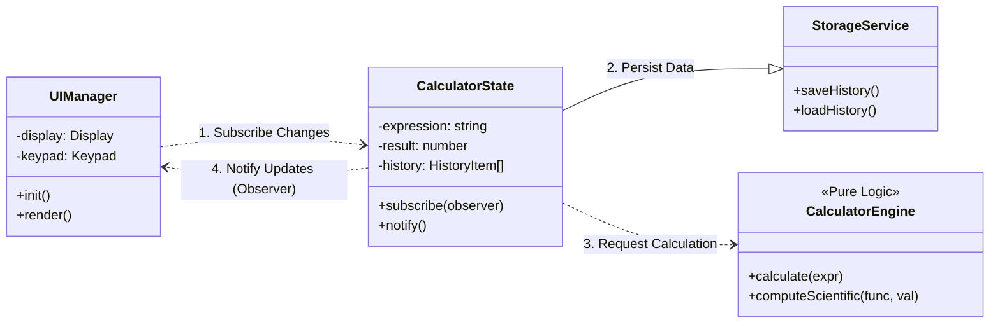

# 🧮 프리미엄 공학용 계산기 (Premium Scientific Calculator)


> **"Pure TypeScript, No Framework, 100% Custom Design"**  
> 프레임워크 없이 디자인 패턴과 순수 기술만으로 완성한 고성능 웹 애플리케이션입니다.

---

## 📖 프로젝트 소개

이 프로젝트는 단순한 계산기 구현을 넘어, **상용 수준의 소프트웨어 아키텍처와 사용자 경험(UX)**을 웹 환경에서 구현하는 것을 목표로 했습니다.
React나 Vue 같은 UI 라이브러리에 의존하지 않고, **순수 TypeScript**와 **DOM API**만으로 상태 관리 시스템과 컴포넌트 렌더링 엔진을 직접 설계하여 구현했습니다.

🔗 **라이브 데모**: [https://yonghwan-ko02.github.io/calculator-demo/](https://yonghwan-ko02.github.io/calculator-demo/)

---

## 🚀 기술적 우수성 (Engineering Excellence)

이 프로젝트가 특별한 이유는 프레임워크의 도움 없이 **Core Web Technology**에 대한 깊은 이해를 바탕으로 설계되었기 때문입니다.

### 1. Zero Dependency & Vanilla Principles
- 불필요한 런타임 라이브러리를 제거하여 번들 사이즈를 최소화하고 성능을 극대화했습니다.
- 프레임워크가 숨기고 있는 **DOM 조작의 원리**와 **이벤트 위임(Simulation)** 등을 직접 제어하며 최적화했습니다.

### 2. Custom State Management System
- 외부 상태 관리 라이브러리(Redux, Zustand 등) 대신, **Observer Pattern**을 직접 구현하여 상태 변화를 감지하고 UI를 업데이트합니다.
- 복잡한 데이터 흐름을 예측 가능하게 만들고, 컴포넌트 간의 결합도(Coupling)를 낮췄습니다.

### 3. Solid Software Architecture
- **SOLID 원칙**과 **Clean Architecture**를 적용하여 비즈니스 로직(Calculation Engine)과 UI 레이어를 엄격하게 분리했습니다.
- 이를 통해 `CalculatorEngine`은 100% 테스트 가능한 순수 함수 형태로 관리됩니다.

---

## 🏗️ 시스템 아키텍처 (System Architecture)

전체 시스템은 **상태(State) - 로직(Engine) - 뷰(UI)**가 명확히 분리된 구조를 가집니다.



1.  **UIManager**: 사용자 입력을 받아 State에 전달하고, State 변경 통지를 받아 화면을 갱신합니다.
2.  **CalculatorState**: 앱의 진실 공급원(Single Source of Truth)입니다. 데이터 변경 시 구독자들에게 알립니다.
3.  **CalculatorEngine**: 순수 수학 연산을 담당하며, UI나 상태에 의존하지 않는 독립적인 모듈입니다.

---

## ✨ 주요 기능

### 🎨 Premium UX/UI
- **Glassmorphism Design**: 최신 트렌드인 유려한 유리 질감 UI.
- **Adaptive Dark Mode**: 시스템 설정 및 사용자 토글에 따른 다크/라이트 모드 지원.
- **Fluid Animations**: 60fps의 부드러운 전환 효과와 햅틱 피드백 시각화.

### 📐 Scientific Computing
- **Scientific Mode**: Engineering에서 Scientific으로 용어를 재정립하고 삼각함수, 로그, 지수 등 공학 연산 지원.
- **Real-time History**: 계산 과정을 실시간으로 기록하고 재사용 가능.
- **Error Handling**: 0으로 나누기 등 예외 상황에 대한 명확한 피드백.

---

## 🛠️ 기술 스택 (Tech Stack)

| Category | Technology | Usage |
|----------|------------|-------|
| **Core** | TypeScript | 정적 타입 시스템을 통한 안정성 확보 |
| **Styling** | Vanilla CSS | CSS Variables를 활용한 테마 시스템 구축 |
| **Build** | Vite | 초고속 HMR 및 최적화된 빌드 |
| **Test** | Vitest | TDD 기반의 유닛 테스트 작성 |
| **CI/CD** | GitHub Actions | 자동화된 빌드 및 배포 파이프라인 |

---

## 💻 설치 및 실행

```bash
# Repository Clone
git clone https://github.com/yonghwan-ko02/calculator-demo.git

# Install Dependencies
npm install

# Run Development Server
npm run dev

# Run Tests
npm test
```

---

## 📝 License

This project is licensed under the MIT License.
