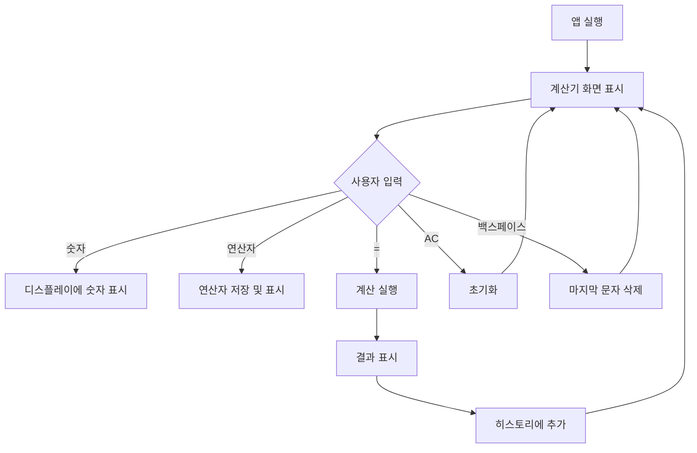
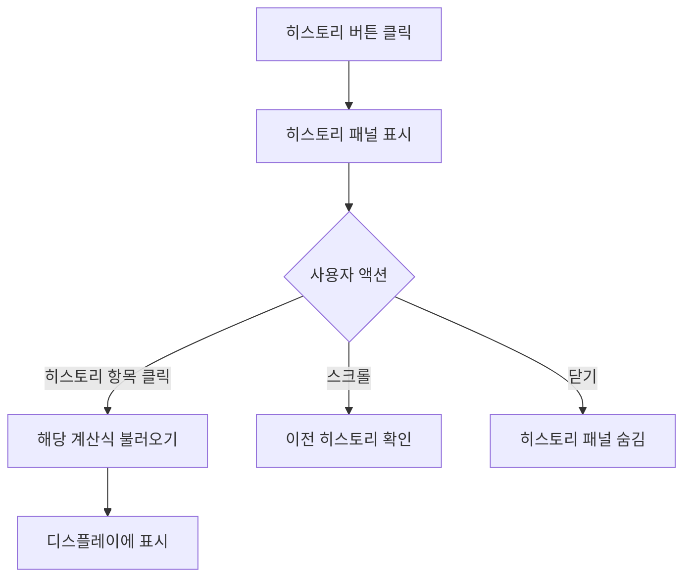
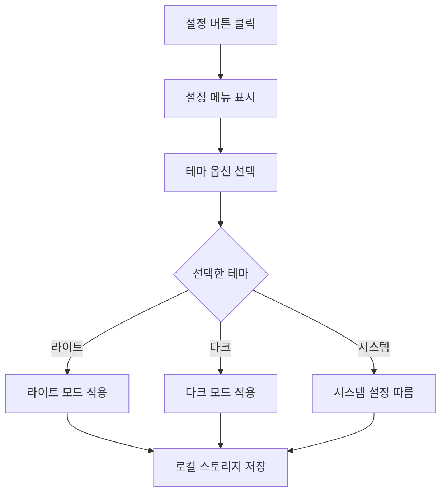

# 공학용 전자계산기 웹앱 PRD (Product Requirements Document)

## 1. 프로젝트 개요

### 1.1 프로젝트 목적
현대적이고 직관적인 UI/UX를 갖춘 공학용 전자계산기 웹 애플리케이션을 개발하여, 사용자가 기본 연산부터 공학 함수까지 쉽게 계산할 수 있는 환경을 제공합니다.

### 1.2 목표 사용자
- 학생 (중/고등학생, 대학생)
- 엔지니어 및 연구원
- 일반 사용자 (기본 계산 필요)

### 1.3 핵심 가치 제안
- **모던한 디자인**: 다크모드 지원, 부드러운 애니메이션, 세련된 UI
- **직관적인 사용성**: 터치 및 키보드 입력 지원
- **계산 히스토리**: 이전 계산 내역 확인 및 재사용
- **반응형 디자인**: 모바일, 태블릿, 데스크톱 모든 환경 지원

---

## 2. 기능 요구사항

### 2.1 핵심 기능 (MVP)

#### 2.1.1 기본 계산 기능
- **사칙연산**: 덧셈(+), 뺄셈(-), 곱셈(×), 나눗셈(÷)
- **소수점 계산**: 소수점 입력 및 계산
- **괄호 연산**: 괄호를 이용한 우선순위 계산
- **퍼센트 계산**: % 연산자 지원
- **입력 삭제**: 백스페이스 기능
- **전체 삭제**: AC (All Clear) 기능

#### 2.1.2 디스플레이 영역
- **현재 입력값 표시**: 대형 폰트(56px)로 현재 입력 중인 수식 표시
- **이전 계산 표시**: 작은 폰트로 이전 계산식 표시
- **커서 표시**: 애니메이션 커서로 입력 위치 표시
- **천 단위 구분**: 숫자 가독성을 위한 콤마 표시

#### 2.1.3 계산 히스토리
- **히스토리 목록**: 스크롤 가능한 이전 계산 내역 표시
- **히스토리 재사용**: 클릭하여 이전 계산 재사용
- **히스토리 하이라이트**: 호버 시 강조 효과
- **히스토리 관리**: 히스토리 보기/숨기기 토글

#### 2.1.4 UI/UX 기능
- **다크모드/라이트모드**: 테마 전환 기능
- **반응형 레이아웃**: 다양한 화면 크기 대응
- **터치 피드백**: 버튼 클릭 시 스케일 애니메이션
- **호버 효과**: 마우스 오버 시 시각적 피드백

### 2.2 확장 기능 (Phase 2)

#### 2.2.1 공학 함수
- **삼각함수**: sin, cos, tan, asin, acos, atan
- **로그 함수**: log, ln
- **지수 함수**: x², x³, xʸ, √, ∛
- **상수**: π, e
- **각도 단위**: Degree/Radian 전환

#### 2.2.2 계산 모드
- **Standard 모드**: 기본 계산기
- **Scientific 모드**: 공학용 계산기
- **Programmer 모드**: 진법 변환 (2진법, 8진법, 16진법)

#### 2.2.3 추가 기능
- **키보드 입력**: 키보드로 숫자 및 연산자 입력
- **복사/붙여넣기**: 계산 결과 복사
- **히스토리 저장**: 로컬 스토리지에 히스토리 저장
- **설정**: 소수점 자릿수, 테마, 각도 단위 등 설정

---

## 3. 디자인 사양

### 3.1 컬러 시스템

#### 라이트 모드
- **Primary**: `#135bec` (파란색)
- **Background**: `#f6f6f8` (밝은 회색)
- **Surface**: `#ffffff` (흰색)
- **Button (Number)**: `#ffffff` (흰색, 그림자 포함)
- **Button (Operator)**: `#f1f5f9` (밝은 회색)
- **Text**: `#0f172a` (진한 회색)
- **Text Secondary**: `#64748b` (중간 회색)

#### 다크 모드
- **Primary**: `#135bec` (파란색)
- **Background**: `#101622` (진한 남색)
- **Surface**: `#0b0f17` (더 진한 남색)
- **Surface Dark**: `#1e2329` (중간 남색)
- **Button (Number)**: `#1e2329` (중간 남색)
- **Button (Operator)**: `#1e2329` (중간 남색)
- **Text**: `#ffffff` (흰색)
- **Text Secondary**: `#94a3b8` (밝은 회색)

### 3.2 타이포그래피
- **Display Font**: Space Grotesk (300, 400, 500, 600, 700)
- **Body Font**: Noto Sans (400, 500, 700)
- **현재 입력값**: 56px, Bold
- **이전 계산**: 18px, Medium
- **히스토리**: 14px (수식), 20px (결과)
- **버튼**: 24px (숫자), 20px (연산자)

### 3.3 레이아웃 구조

```
┌─────────────────────────────────┐
│  Header (History | Mode | Settings) │
├─────────────────────────────────┤
│                                 │
│  History Area (Scrollable)      │
│  - Previous calculations        │
│                                 │
├─────────────────────────────────┤
│  Display Area                   │
│  - Previous expression          │
│  - Current input (Large)        │
│  - Swipe indicator              │
├─────────────────────────────────┤
│  Keypad Area                    │
│  ┌───┬───┬───┬───┐             │
│  │AC │( )│ % │ ÷ │             │
│  ├───┼───┼───┼───┤             │
│  │ 7 │ 8 │ 9 │ × │             │
│  ├───┼───┼───┼───┤             │
│  │ 4 │ 5 │ 6 │ - │             │
│  ├───┼───┼───┼───┤             │
│  │ 1 │ 2 │ 3 │ + │             │
│  ├───┼───┼───┼───┤             │
│  │ 0 │ . │ ← │ = │             │
│  └───┴───┴───┴───┘             │
└─────────────────────────────────┘
```

### 3.4 컴포넌트 사양

#### 3.4.1 버튼
- **크기**: 정사각형 (aspect-ratio: 1)
- **간격**: 12px
- **둥근 모서리**: 12px (xl)
- **애니메이션**: 
  - 호버: 배경색 변경
  - 클릭: scale(0.95)
  - 전환: all 0.2s ease

#### 3.4.2 히스토리 아이템
- **투명도**: 기본 60%, 호버 100%
- **패딩**: 8px
- **둥근 모서리**: 8px
- **호버 효과**: 배경색 변경

#### 3.4.3 스크롤바
- **너비**: 4px
- **색상**: `#cbd5e1` (라이트), `#475569` (다크)
- **둥근 모서리**: 20px

---

## 4. 기술 스택

### 4.1 프론트엔드
- **HTML5**: 마크업
- **CSS3**: 스타일링 (Tailwind CSS 사용)
- **JavaScript (ES6+)**: 로직 구현
- **Tailwind CSS**: 유틸리티 기반 CSS 프레임워크

### 4.2 폰트 및 아이콘
- **Google Fonts**: Space Grotesk, Noto Sans
- **Material Symbols**: 아이콘 (history, settings, backspace)

### 4.3 개발 도구
- **버전 관리**: Git
- **패키지 매니저**: npm/yarn
- **빌드 도구**: Vite (권장)
- **코드 포맷터**: Prettier
- **린터**: ESLint

---

## 5. 사용자 플로우

### 5.1 기본 계산 플로우


### 5.2 히스토리 사용 플로우


### 5.3 테마 전환 플로우


---

## 6. 데이터 구조

### 6.1 계산 히스토리
```javascript
{
  id: string,              // 고유 ID (timestamp)
  expression: string,      // 계산식 (예: "12 + 88")
  result: number,          // 계산 결과 (예: 100)
  timestamp: Date          // 계산 시각
}
```

### 6.2 애플리케이션 상태
```javascript
{
  currentInput: string,    // 현재 입력 중인 값
  previousInput: string,   // 이전 입력값
  operator: string | null, // 현재 연산자
  history: Array,          // 계산 히스토리 배열
  mode: string,            // 계산기 모드 (standard, scientific, programmer)
  theme: string,           // 테마 (light, dark, system)
  angleUnit: string        // 각도 단위 (degree, radian)
}
```

### 6.3 로컬 스토리지 구조
```javascript
{
  "calculator_history": Array,    // 히스토리 데이터
  "calculator_theme": string,     // 테마 설정
  "calculator_mode": string,      // 계산기 모드
  "calculator_settings": {        // 기타 설정
    angleUnit: string,
    decimalPlaces: number
  }
}
```

---

## 7. 핵심 로직

### 7.1 계산 엔진
- **수식 파싱**: 문자열 수식을 토큰으로 분리
- **연산자 우선순위**: 괄호 > 곱셈/나눗셈 > 덧셈/뺄셈
- **에러 처리**: 0으로 나누기, 잘못된 수식 등
- **정밀도**: 부동소수점 오차 처리

### 7.2 입력 처리
- **숫자 입력**: 연속 입력, 소수점 중복 방지
- **연산자 입력**: 연속 연산자 방지, 마지막 연산자 교체
- **괄호 입력**: 괄호 짝 맞추기
- **백스페이스**: 마지막 문자 삭제

### 7.3 디스플레이 포맷팅
- **천 단위 구분**: 1,245.50 형식
- **소수점 처리**: 불필요한 0 제거 또는 유지
- **오버플로우**: 긴 숫자 처리 (스크롤 또는 축소)

---

## 8. 비기능 요구사항

### 8.1 성능
- **초기 로딩 시간**: 2초 이내
- **계산 응답 시간**: 100ms 이내
- **애니메이션**: 60fps 유지
- **메모리 사용**: 히스토리 최대 100개 항목

### 8.2 접근성
- **키보드 네비게이션**: Tab, Enter, 숫자 키 지원
- **스크린 리더**: ARIA 레이블 적용
- **색상 대비**: WCAG AA 기준 준수
- **터치 타겟**: 최소 44x44px

### 8.3 호환성
- **브라우저**: Chrome, Firefox, Safari, Edge (최신 2개 버전)
- **모바일**: iOS 14+, Android 10+
- **화면 크기**: 320px ~ 2560px

### 8.4 보안
- **XSS 방지**: 입력값 sanitization
- **eval() 사용 금지**: 안전한 수식 파서 사용
- **로컬 스토리지**: 민감 정보 저장 금지

---

## 9. 개발 우선순위

### Phase 1: MVP (2주)
- [x] 프로젝트 설정 및 환경 구축
- [ ] 기본 UI 레이아웃 구현
- [ ] 숫자 입력 및 디스플레이
- [ ] 사칙연산 기능
- [ ] 기본 버튼 (AC, 백스페이스, =)
- [ ] 라이트/다크 모드 전환

### Phase 2: 고급 기능 (1주)
- [ ] 계산 히스토리 구현
- [ ] 히스토리 저장 (로컬 스토리지)
- [ ] 괄호 연산
- [ ] 퍼센트 계산
- [ ] 키보드 입력 지원

### Phase 3: 공학 함수 (1주)
- [ ] Scientific 모드 UI
- [ ] 삼각함수
- [ ] 로그/지수 함수
- [ ] 상수 (π, e)
- [ ] 각도 단위 전환

### Phase 4: 최적화 및 테스트 (1주)
- [ ] 성능 최적화
- [ ] 접근성 개선
- [ ] 크로스 브라우저 테스트 (수동)
- [ ] 모바일 최적화
- [ ] 코어 로직 단위 테스트 완성도 확인
- [ ] 버그 수정

---

## 10. 성공 지표

### 10.1 사용자 경험
- **첫 화면 로딩**: 2초 이내
- **버튼 반응 시간**: 50ms 이내
- **계산 정확도**: 100% (소수점 10자리까지)

### 10.2 기술 지표
- **코드 커버리지**: 80% 이상
- **Lighthouse 점수**: 
  - Performance: 90+
  - Accessibility: 95+
  - Best Practices: 95+
  - SEO: 90+

### 10.3 사용자 만족도
- **직관성**: 첫 사용자도 설명 없이 사용 가능
- **반응성**: 모든 인터랙션에 즉각적인 피드백
- **안정성**: 에러 없이 연속 계산 가능

---

## 11. 리스크 및 제약사항

### 11.1 기술적 리스크
- **부동소수점 오차**: JavaScript의 부동소수점 연산 한계
  - **완화 방안**: 정밀도 라이브러리 사용 (예: decimal.js)
- **브라우저 호환성**: 구형 브라우저 지원
  - **완화 방안**: Polyfill 및 트랜스파일링

### 11.2 제약사항
- **오프라인 지원**: 초기 버전에서는 미지원
- **계산 복잡도**: 매우 복잡한 수식은 성능 저하 가능
- **히스토리 용량**: 로컬 스토리지 용량 제한 (5MB)

---

## 12. 향후 확장 계획

### 12.1 추가 기능
- **단위 변환기**: 길이, 무게, 온도 등
- **통화 변환**: 실시간 환율 적용
- **그래프 기능**: 함수 그래프 시각화
- **수식 편집기**: 복잡한 수식 입력

### 12.2 플랫폼 확장
- **PWA**: 오프라인 지원, 설치 가능
- **네이티브 앱**: Electron (데스크톱), React Native (모바일)
- **브라우저 확장**: Chrome Extension

### 12.3 협업 기능
- **클라우드 동기화**: 여러 기기 간 히스토리 동기화
- **공유 기능**: 계산 결과 공유
- **워크스페이스**: 프로젝트별 계산 관리

---

## 13. 참고 자료

### 13.1 디자인 참고
- 제공된 디자인 파일: `design/screen.png`, `design/code.html`
- Material Design Guidelines
- Apple Human Interface Guidelines

### 13.2 기술 문서
- [Tailwind CSS Documentation](https://tailwindcss.com/docs)
- [MDN Web Docs - Math](https://developer.mozilla.org/en-US/docs/Web/JavaScript/Reference/Global_Objects/Math)
- [Google Fonts](https://fonts.google.com/)

---

## 부록: 용어 정의

- **MVP**: Minimum Viable Product (최소 기능 제품)
- **PWA**: Progressive Web App (프로그레시브 웹 앱)
- **ARIA**: Accessible Rich Internet Applications (접근 가능한 리치 인터넷 애플리케이션)
- **WCAG**: Web Content Accessibility Guidelines (웹 콘텐츠 접근성 가이드라인)
- **XSS**: Cross-Site Scripting (크로스 사이트 스크립팅)
